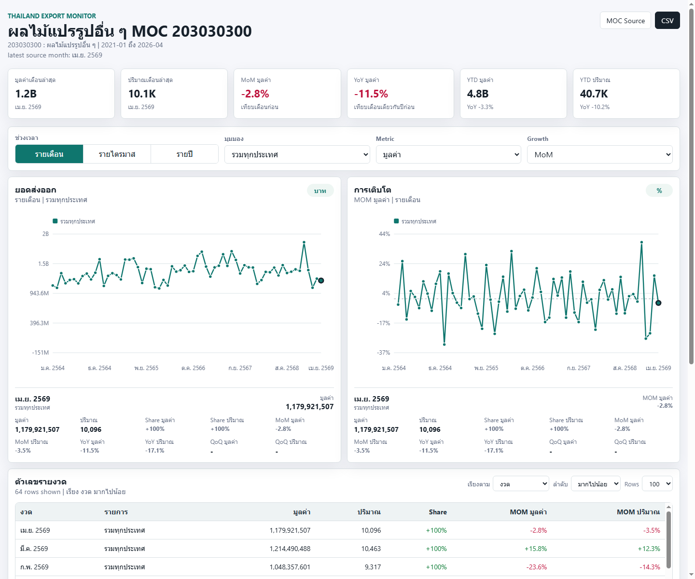

# Dashboard ยอดส่งออก: ผลไม้แปรรูปอื่น ๆ

Static dashboard สำหรับดูยอดส่งออกไทยของ **ผลไม้แปรรูปอื่น ๆ** ตามโครงสร้างสินค้ากระทรวงพาณิชย์

- MOC code: `203030300 : ผลไม้แปรรูปอื่น ๆ`
- Parent code จากรูปอ้างอิง: `203030000 : ผลไม้แปรรูป`
- Source kind: MOC export commodity structure code (`com_code`) 9 หลัก
- Important note: code นี้ไม่ใช่ HS 6 หลักแบบ Harmonized System
- Coverage: `2021-01` ถึง `2026-04`
- Latest valid source month: เมษายน 2569
- Latest value: `1,179,921,507` บาท
- Latest quantity: `10,096.142` เมตริกตัน

## Source

- Search page: https://tradereport.moc.go.th/th/searchproductexport
- Report page: https://tradereport.moc.go.th/th/stat/reportcomcodeexport02
- Open Data API: https://tradereport.moc.go.th/opendata/exportcommoditycountries
- API template:

```text
https://tradereport.moc.go.th/api/exportcommoditycountries?year={year}&month={month}&com_code=203030300&limit=1000
```

## Validation

- Country-month rows: `6,903`
- Month count: `64`
- Latest valid period: `2026-04`
- `2026-05` และ `2026-06` ถูก probe แล้วแต่เป็น zero-placeholder ทั้งเดือน จึงไม่ใช้เป็น latest analytical month
- World total ใน dashboard aggregate จากรายประเทศ เพราะ official Open Data API คืนรายประเทศ ไม่ได้คืน world summary row แยก
- Unmapped country count: `0`

## Files

- `index.html` - dashboard
- `styles.css` - reference dashboard styling
- `app.js` - reference dashboard interaction/chart logic
- `data.js` - embedded data for static dashboard
- `data/dataset.json` - full dataset
- `data/monthly_country_comcode203030300.csv` - monthly country data
- `data/monthly_continent_comcode203030300.csv` - monthly continent data
- `data/monthly_total_comcode203030300.csv` - monthly total data
- `data/validation_reconciliation.csv` - validation/probe notes
- `dashboard_preview.png` - rendered preview

## Preview


